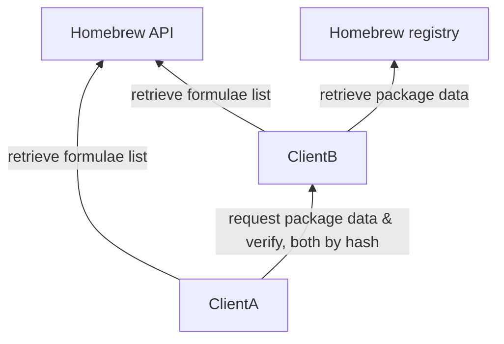

# brew party

> [!WARNING]
> :building_construction:
> This is a stub for an idea that may never happen.
> Don't take it seriously unless it actually starts working.
> It's not an official Homebrew project.

**Retrieve Homebrew packages from similar clients on the network**

## General Idea

A requests a package data file from B based on a hash retrieved from the Homebrew API.

## Inspiration

* Steam LAN Sync
* A Bitcoin client LAN sync idea I had in 2013 and cannot find evidence of talking about it publicly
